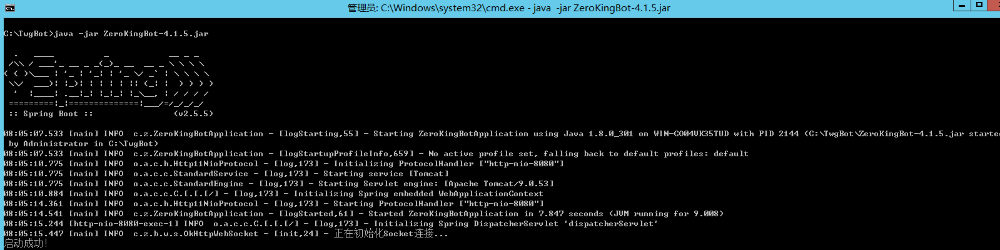
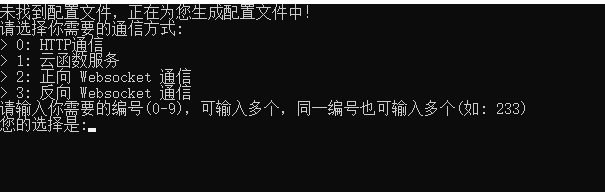
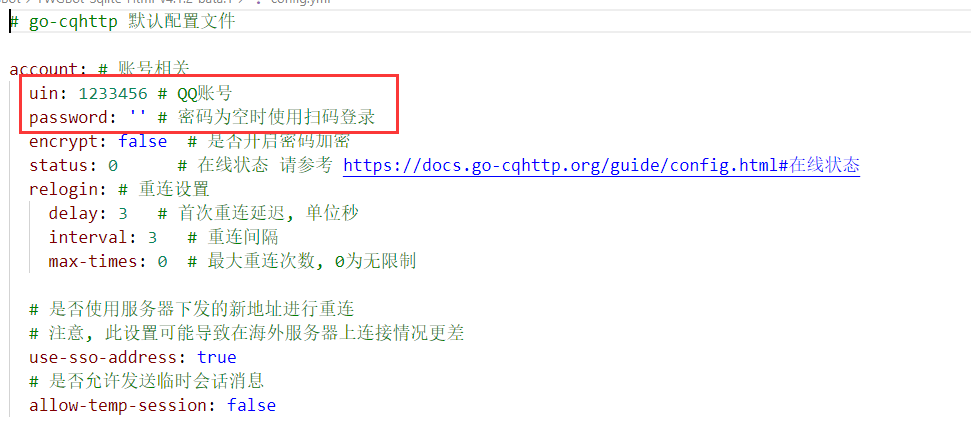
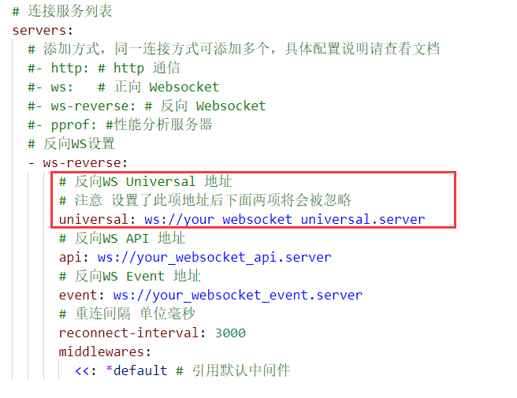
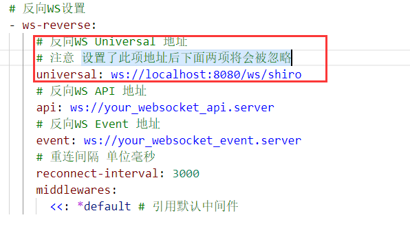
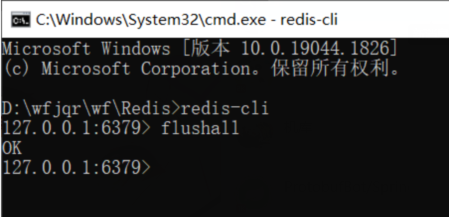
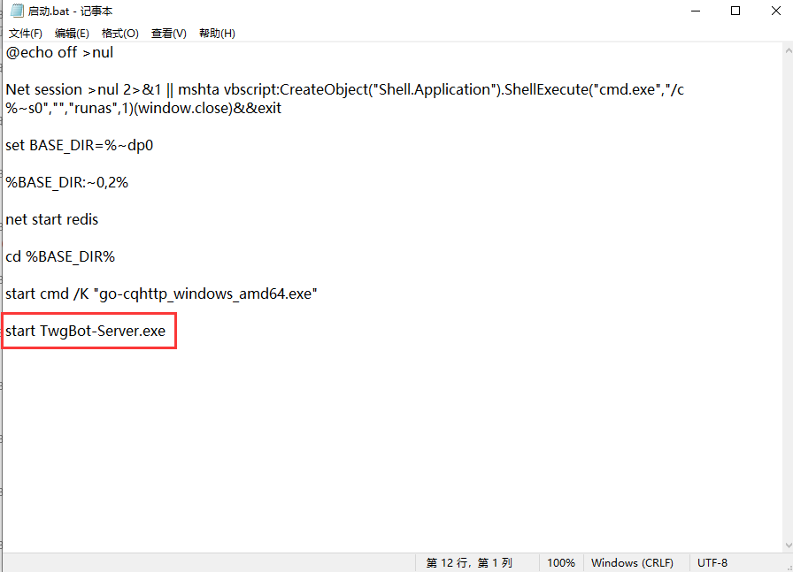
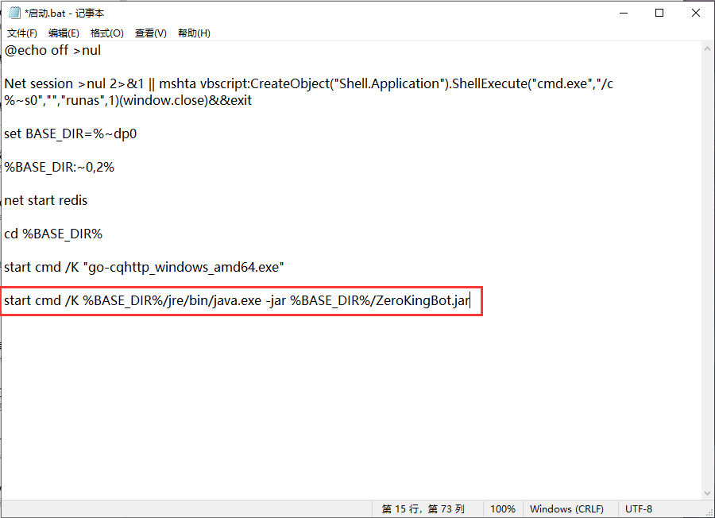

# 本教程适用于 4.1.3 - 4.1.7.2 之间的版本
# 如果您使用的是最新版本请查看 [4.1.7.3+](./4173+/win.md)
如果您是之前版本迁移来的请看 <a href="#update">**适用于TWGBot 4.0.9~4.1.2迁移版本**</a>
  
Windows部署教程
---
---
- 使用搜索引擎 搜索 [Java8](https://www.java.com/zh-CN/) 下载并安装
- 配置 Java 的 [环境变量](https://zhuanlan.zhihu.com/p/146558611)
- 回到 放置ZeroKingBot.jar的文件夹下  
  按住Shift键+鼠标右键 选择 打开于 PowerShell 
  或者直接在导航栏输入 cmd 按回车。打开黑窗口
- 在黑窗口中输入 **java -jar ZeroKingBot.jar** 按下回车，之后出现 **启动成功** 说明部署完成 **x代表版本号**
  

- **4.1.7.3 版本之后无需下载Go-cqhttp**
- **4.1.7.3 版本之后启动Jar包会自动下载配置**
  
  - **你只需要配置gocqhttp文件夹中的config.yml中的账号密码即可** 

- 您需要自行下载OneBot协议实现的机器人程序例如 [go-cqhttp](https://github.com/Mrs4s/go-cqhttp/releases)
  - 这里以go-cqhttp 为例：
     - 下载跟您系统相匹配的版本，之后双击启动
     - 根据提示下一步，最后根据提示双击.bat文件启动go-cqhttp
     - 之后会让你选择，这里选择 3  按下键盘上的 3 然后按回车就好了。
     - 
     - 选择完之后会让你重启go-cqhttp，在此之前我们先修改一下 **config.yml**
     - 
     - 在这里填写上你用作**机器人的QQ账号与密码。**
     - 注意：**密码需要填写到''中间**
     - 例如：**'123456'**
     - 
     - 更改 **universal**后面的值
     - 更改为： **ws://localhost:8080/ws/shiro**
     - 
- 之后双击 **"go-cqhttp.bat"** 启动，**根据提示操作**。
- 查看go-cqhttp窗口中是否出现 **已连接到反向服务器** 若出现此提示则说明部署成功了

适用于TWGBot 4.0.9~4.1.2迁移版本
---
---

- 您需要删除文件夹中的 **db文件夹** 
- 在Reids文件夹中打开Cmd窗口 输入 **redis-cli**
- 执行 **flushall** 命令
- 
- 将 **TWGBot-Server.exe**  替换为 **ZeroKingBot.jar** 
- 修改启动.bat 右键编辑/打开方式 选择记事本打开
- 
- 修改为 **start cmd /K %BASE_DIR%/jre/bin/java.exe -jar %BASE_DIR%/ZeroKingBot.jar**
- 
- 之后**关闭所有窗口重新启动**即可

